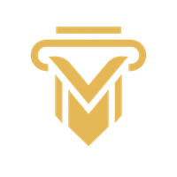

   
  <h2 align="center">Conserv (CST)</h2>

**Conserv (CST)** is an ERC20 token built on the **Ethereum blockchain**, created to embody the strength of **conservative values**: prudence, stability, responsibility, and respect for **traditions** that sustain prosperous societies.  
In a world where *fleeting narratives* and *modern ideologies* dominate cultural and political discourse, **Conserv** stands as a reminder that **true prosperity cannot rest on passing trends**, but on the **balance between innovation and enduring principles**.  
**CST represents the return of conservative culture** — a call to **rediscover lasting values** in the face of movements that, *under the banner of “progress”*, often obscure what truly **strengthens free and resilient communities**.  

In the crypto space, frequently driven by **hype** and **short-term speculation**, **Conserv boldly takes a different stance**: it emphasizes **measured growth**, **long-term vision**, and **trustworthy participation**.  
Just as **enduring values** provide guidance through changing times, **Conserv** combines **solid economic foundations** with the opportunities of **modern decentralized finance (DeFi)**.  

Its mission is to deliver a **predictable and sustainable token** — one that **rewards commitment**, **encourages responsible involvement**, and stands as both a **symbol of conservative strength** and a **stable counterweight** to the **volatility of speculative trends**.  

---

## 📜 Token Information

- **Name:** Conserv  
- **Symbol:** CST  
- **Standard:** ERC20 (Ethereum)  
- **Contract Address:** `0xF4f20629399F24d8F5d3Cb49b799Dc3B6128311b`  
- **Decimals:** 18  
- **Initial Supply:** 200,000 CST  
- **Max Supply:** 12,200,000 CST  

---

## 🔑 Key Features

- ✅ **Staking rewards** – Incentivizes long-term holders  
- ✅ **Capped supply** – Hard cap of 12.2 million CST  
- ✅ **Anti-abuse mechanisms** – Flash staking protection and minting limits  
- ✅ **Auditable code** – Open-source, based on OpenZeppelin standards  

---

## 🌐 Official Links

- **Etherscan Contract:** [View on Etherscan](https://etherscan.io/token/0xF4f20629399F24d8F5d3Cb49b799Dc3B6128311b)
- **GitHub Repository:** [Conserv](https://github.com/TakatoBr/CST)
- **Email:** teamconserv@gmail.com

---

## 📥 How to Add to MetaMask

1. Open your **MetaMask** wallet  
2. Click *Import Token*  
3. Paste the contract address: `0xF4f20629399F24d8F5d3Cb49b799Dc3B6128311b`
4. Confirm, and you’re all set 🚀 
